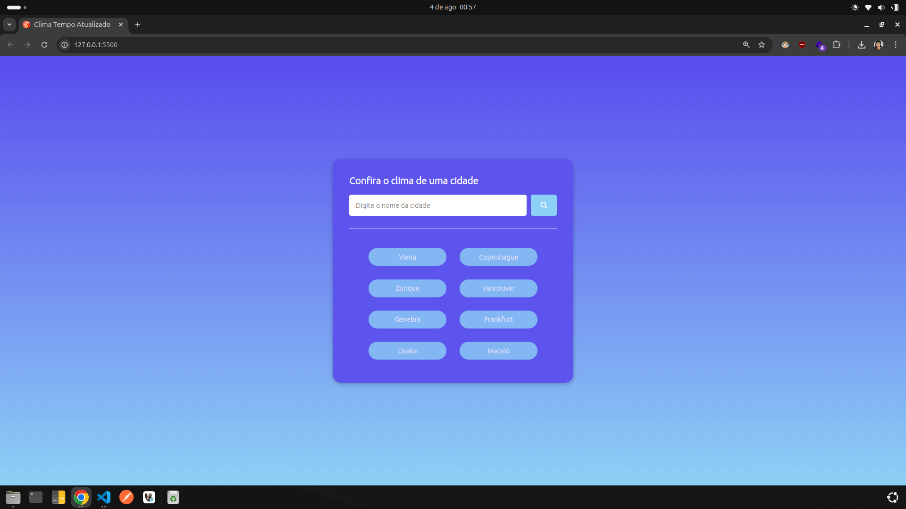
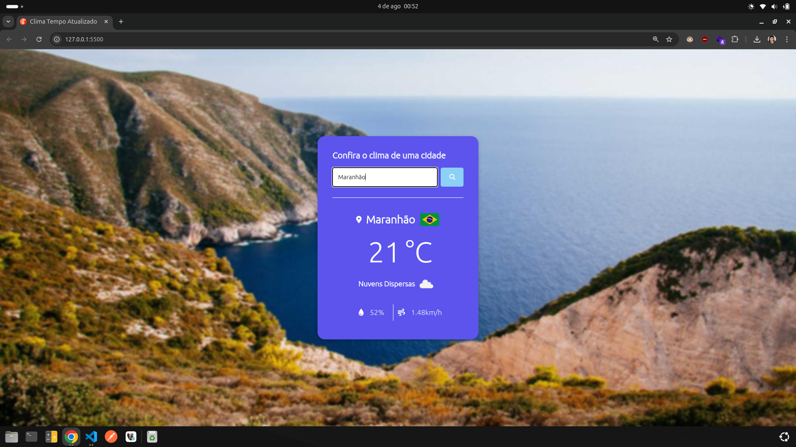

# Clima Tempo com OpenWeather API 🌦️

Com esse projeto trouxe condições climáticas de qualquer cidade do mundo utiliza várias APIs para fornecer informações como bandeiras dos países, imagens de fundo e dados meteorológicos, tudo em uma única interface. Muito desafiador e instigante! 

## Deploy ☁️
Acesse o projeto em [Clima Tempo Atualizado](https://app-clima-tempo-api-open-weather.vercel.app/) para visualizar as condições climáticas atualizadas.

## APIs Utilizadas 🌐

- **OpenWeather:** Fornece dados meteorológicos como temperatura, umidade e velocidade do vento.
  - [Documentação e Cadastro](https://openweathermap.org/)
- **FlagsAPI:** Fornece imagens das bandeiras dos países.
  - [Country Flags API](https://flagsapi.com)
- **Lorem Picsum:** Gera imagens de fundo aleatórias para o site.
  - [Lorem Picsum](https://picsum.photos/)

## Tecnologias e Habilidades 📚🛠️

### HTML
- Uso de tags semânticas
- Integração com APIs externas
- Inclusão de fontes e ícones através de bibliotecas como [Google Fonts](https://fonts.googleapis.com) e [Font Awesome](https://cdnjs.cloudflare.com/ajax/libs/font-awesome/6.2.0/css/all.min.css)

### CSS
- Flexbox para layout responsivo
- Media queries para adaptação a diferentes tamanhos de tela
- Utilização de gradientes

### JavaScript
- Manipulação do DOM
- Tratamento de eventos
- Funções assíncronas com `fetch`

## Funcionalidades 🌟

- **Busca por Cidade:** Digite o nome de uma cidade e obtenha informações climáticas detalhadas.
- **Sugestões de Cidades:** Botões com sugestões de cidades populares para busca rápida.
- **Tratamento de Erros:** Exibe mensagens de erro caso a cidade não seja encontrada ou ocorra um problema com a API.

### Imagens app

